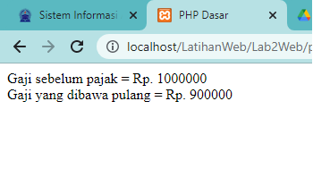
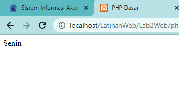
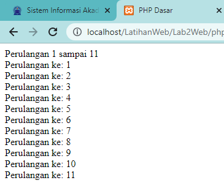

# Lab2Web

## Laporan Praktikum

1.  Hello World dan Variabel

        ```php
        <!DOCTYPE html>
        <html lang="en">
          <head>
            <meta charset="UTF-8" />
            <title>PHP Dasar</title>
          </head>

          <body>
            <h1>Belajar PHP Dasar</h1>
            <?php
                        echo "Hello World";
                        ?>
            <h1>Menggunakan Variabel</h1>
            <?php
                        $nim = "0411500400";
                        $nama = 'Abdullah';
                        echo "NIM : " . $nim . "<br>"; echo "Nama : $nama"; ?>
          </body>
        </html>
        ```

    Hasil<br>
    

2.  Membuat Form

    ```php
      <!DOCTYPE html>
      <html lang="en">

      <head>
          <meta charset="UTF-8">
          <title>PHP Dasar</title>
      </head>

      <body>
          <h2>Form Input</h2>
          <form method="post">
              <label>Nama: </label>
              <input type="text" name="nama">
              <input type="submit" value="Kirim">
          </form>
          <?php
          echo 'Selamat Datang ' . $_POST['nama'];
          ?>
      </body>

      </html>
    ```

    Hasil<br>
    

3.  Operator

    ```php
      <!DOCTYPE html>
      <html lang="en">

      <head>
          <meta charset="UTF-8">
          <title>PHP Dasar</title>
      </head>

      <body>
          <?php
          $gaji = 1000000;
          $pajak = 0.1;
          $thp = $gaji - ($gaji * $pajak);
          echo "Gaji sebelum pajak = Rp. $gaji <br>";
          echo "Gaji yang dibawa pulang = Rp. $thp";
          ?>
      </body>

    ```

    Hasil<br>
    

4.  KOndisi IF

    ```php
      <?php
      $nama_hari = date("1");
      if ($nama_hari == "Sunday") {
          echo "Minggu";
      } elseif ($nama_hari == "Monday") {
          echo "Senin";
      } else {
          echo "Selasa";
      }
      ?>

    ```

    Hasil<br>
    

5.  KOndisi Switch

    ```php
      <?php
      $nama_hari = date("3");
      switch ($nama_hari) {
          case "Sunday":
              echo "Minggu";
              break;
          case "Monday":
              echo "Senin";
              break;
          case "Tuesday":
              echo "Selasa";
              break;
          default:
              echo "Sabtu";
      }
      ?>

    ```

    Hasil<br>
    

6.  Perulangan For

    ```php
      <?php
      echo "Perulangan 1 sampai 10 <br />";
      for ($i = 1; $i <= 10; $i++) {
          echo "Perulangan ke: " . $i . '<br />';
      }
      echo "Perulangan Menurun dari 10 ke 1 <br />";
      for ($i = 10; $i >= 1; $i--) {
          echo "Perulangan ke: " . $i . '<br />';
      }
      ?>

    ```

    Hasil<br>
    

7.  Perulangan For

    ```php
      <?php
      echo "Perulangan 1 sampai 10 <br />";
      $i = 1;
      while ($i <= 10) {
          echo "Perulangan ke: " . $i . '<br />';
          $i++;
      }
      ?>

    ```

    Hasil<br>
    

8.  Perulangan For

    ```php
      <?php
      echo "Perulangan 1 sampai 11 <br />";
      $i = 1;
      do {
          echo "Perulangan ke: " . $i . '<br />';
          $i++;
      } while ($i <= 11);
      ?>

    ```

    Hasil<br>
    

## TUGAS PERTEMUAN 3

- Pertanyaan dan Tugas<br>
  Buatlah program PHP sederhana dengan menggunakan form input yang menampilkan nama, tanggal
  lahir dan pekerjaan. Kemudian tampilkan outputnya dengan menghitung umur berdasarkan inputan
  tanggal lahir. Dan pilihan pekerjaan dengan gaji yang berbeda-beda sesuai pilihan pekerjaan.
- Jawaban

  1. Pertama kita buat code html seperti ini

     ```html
     <!DOCTYPE html>
     <html>
       <head>
         <title>Program PHP Sederhana</title>
       </head>
       <body>
         <h1>Form Input Data Pribadi</h1>
         <form method="POST" action="<?php echo $_SERVER['PHP_SELF']; ?>">
           Nama: <input type="text" name="nama" /><br /><br />
           Tanggal Lahir: <input type="date" name="tanggal_lahir" /><br /><br />
           Pekerjaan:
           <select name="pekerjaan">
             <option value="Programmer">Programmer</option>
             <option value="Desainer">Desainer</option>
             <option value="Pengusaha">Pengusaha</option>
             <option value="Karyawan">Karyawan</option></select
           ><br /><br />
           <input type="submit" name="submit" value="Submit" />
         </form>
         <br />
       </body>
     </html>
     ```

  2. Kemudian masukkan code php berikut

     ```php
     <?php
     if ($_SERVER["REQUEST_METHOD"] == "POST") {
       // Memeriksa apakah form sudah di-submit
       $nama = $_POST["nama"];
       $tanggal_lahir = $_POST["tanggal_lahir"];
       $pekerjaan = $_POST["pekerjaan"];

       // Menghitung umur berdasarkan tanggal lahir
       $tanggal_lahir = new DateTime($tanggal_lahir);
       $sekarang = new DateTime();
       $umur = $sekarang->diff($tanggal_lahir)->y;

       // Menentukan gaji berdasarkan pekerjaan
       switch ($pekerjaan) {
         case 'Programmer':
           $gaji = 10000000;
           break;
         case 'Desainer':
           $gaji = 8000000;
           break;
         case 'Pengusaha':
           $gaji = 15000000;
           break;
         case 'Karyawan':
           $gaji = 5000000;
           break;
         default:
           $gaji = 0;
           break;
       }

       // Menampilkan output
       echo "<h2>Output:</h2>";
       echo "Nama: " . $nama . "<br>";
       echo "Tanggal Lahir: " . date_format($tanggal_lahir, 'd-m-Y') . "<br>";
       echo "Umur: " . $umur . " tahun<br>";
       echo "Pekerjaan: " . $pekerjaan . "<br>";
       echo "Gaji: Rp " . number_format($gaji, 0, ',', '.') . "<br>";
     }
     ?>
     ```

  3. Hasil<br>
     
