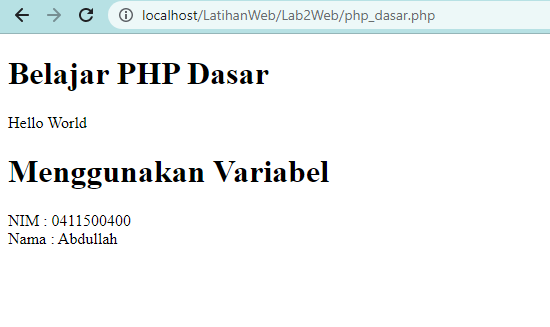
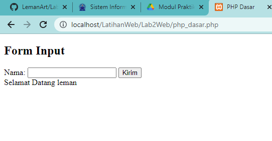

# Lab2Web

## Laporan Praktikum

1.  Hello World dan Variabel

    ```php
    <!DOCTYPE html>
    <html lang="en">
      <head>
        <meta charset="UTF-8" />
        <title>PHP Dasar</title>
      </head>

      <body>
        <h1>Belajar PHP Dasar</h1>
        <?php
                    echo "Hello World";
                    ?>
        <h1>Menggunakan Variabel</h1>
        <?php
                    $nim = "0411500400";
                    $nama = 'Abdullah';
                    echo "NIM : " . $nim . "<br>"; echo "Nama : $nama"; ?>
      </body>
    </html>
    ```

Hasil


2. Membuat Form

   ```php
     <!DOCTYPE html>
     <html lang="en">

     <head>
         <meta charset="UTF-8">
         <title>PHP Dasar</title>
     </head>

     <body>
         <h2>Form Input</h2>
         <form method="post">
             <label>Nama: </label>
             <input type="text" name="nama">
             <input type="submit" value="Kirim">
         </form>
         <?php
         echo 'Selamat Datang ' . $_POST['nama'];
         ?>
     </body>

     </html>
   ```

Hasil

